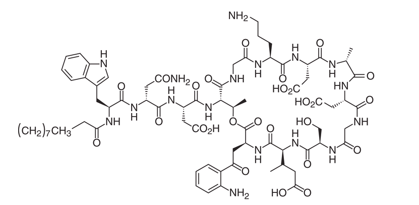
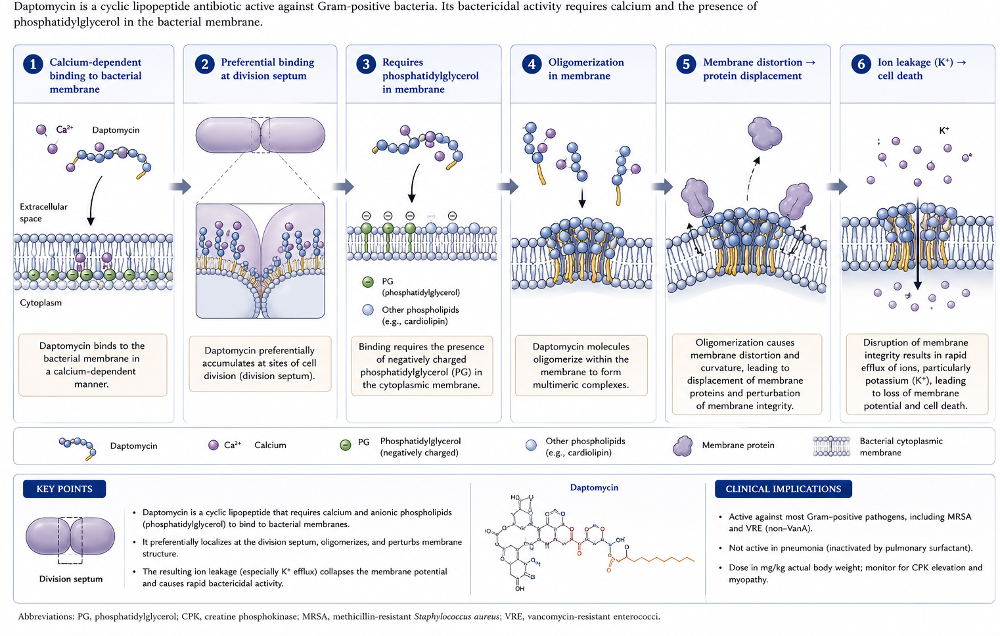

## Daptomycin and Streptogramins {background-video="streptogramins-images/staphy.mp4" background-video-loop="true" background-video-muted="true" background-opacity="0.35" background-color="#b20e10"}

 

 

 

   

**Russell E. Lewis, Pharm.D., FCCP**   Associate Professor of Infectious Diseases  

{fig-align="center" width="350"}

   russelledward.lewis\@unipd.it   Slides and course materials: [www.idpadovaid.com](https://idpadova.com/)

## Learning Objectives

 

After this lecture, you should be able to:

1.  Describe the mechanism of action of daptomycin
2.  Understand daptomycin's spectrum of activity and susceptibility testing
3.  Explain mechanisms of daptomycin resistance
4.  Apply appropriate dosing for different clinical scenarios
5.  Recognize adverse effects and monitoring requirements
6.  Identify clinical indications for daptomycin use

::: notes
This lecture covers two important antibiotic classes used primarily for gram-positive infections. We'll focus mainly on daptomycin as it's more commonly used clinically. Quinupristin-dalfopristin has limited use due to side effects and availability issues.
:::

# Part 1: Daptomycin basics {background-color="#b20e10"}

## What is Daptomycin?

 

- **Cyclic lipopeptide antibiotic** (1620.67 Da)
- Produced by *Streptomyces roseosporus*
- Discovered in the 1980s- Eli Lilly
- FDA approved: 2003 (US), 2006 (Europe)

::: aside
Daptomycin has an interesting history - it was initially shelved due to muscle toxicity seen with twice-daily dosing. The "resurrection" came when researchers discovered that once-daily dosing dramatically reduced this toxicity while maintaining efficacy.
:::

## Chemical Structure

 

{fig-align="center"}

::: aside
The structure shows the cyclic peptide core with a lipophilic tail (decanoic acid side chain). This amphipathic structure is critical for membrane insertion. The molecule contains 13 amino acids arranged in a cyclic structure.
:::

## Mechanism of Action

{fig-align="center" width="800"}

::: aside
The calcium dependence is clinically important because susceptibility testing must use calcium-supplemented media. The binding at the division septum may explain why actively dividing cells are more susceptible. Recent work shows daptomycin also interacts with lipid-II, forming a tripartite complex that impedes peptidoglycan synthesis.
:::

:::{.refs}
[@Silverman2003; @Pogliano2012; @Jung2004; @MullerA2016]
:::

## Key Feature: Bactericidal without lysis

 

- Kills bacteria **without significant cell lysis**
- Results in **reduced inflammatory response**
- Less release of proinflammatory mediators
- Potential advantage in severe infections

::: aside
This may be a clinical advantage compared to β-lactams and vancomycin, which cause cell lysis and release of inflammatory mediators. It has been hypothesized that this may translate to less inflammatory injury in infections like endocarditis.
:::

:::{.refs}
[@Silverman2003]
:::

# Part 2: Antimicrobial spectrum {background-color="#b20e10"}

## Spectrum of activity

 

**Active against:**

- *Staphylococcus aureus* (MSSA, MRSA, VISA)
- Coagulase-negative staphylococci
- *Enterococcus faecalis* and *E. faecium* (including VRE)
- Streptococci
- Some gram-positive anaerobes

::: aside
The spectrum closely overlaps glycopeptides but daptomycin often retains activity against organisms with decreased vancomycin susceptibility. **Activity against VRE is particularly important given limited treatment options.**
:::

## Organisms with variable/No activity

 

**Variable activity:**

- *Actinomyces* spp. (MIC~90~ 4-32 μg/mL)
- *Lactobacillus* spp.
- Some clostridial species

**No activity:**

- Gram-negative organisms
- **Pulmonary infections** (surfactant inactivation!)

::: aside
Daptomycin is inactivated by pulmonary surfactant and should NEVER be used for pneumonia! This is a common board question and clinical error.
:::

## Susceptibility testing challenges

 

::: callout-warning
**Calcium-supplemented Mueller-Hinton broth is REQUIRED** (50 μg/mL calcium concentration)
:::

- Disk diffusion: **NOT recommended**
- Etest: Variable reproducibility
- Broth microdilution: Preferred method
- Significant interlaboratory variability exists

::: notes
Susceptibility testing for daptomycin is notoriously challenging. Labs should be aware that results can vary significantly. When possible, broth microdilution should be used, especially for serious infections.
:::

:::{.refs}
[@Campeau2018; @Humphries2011]
:::

## Susceptibility breakpoints

 

| Organism                 | Susceptible | Intermediate    | Resistant |
|--------------------------|-------------|-----------------|-----------|
| Staphylococci            | ≤1 μg/mL    | \-              | \>1 μg/mL |
| Streptococci             | ≤1 μg/mL    | \-              | \>1 μg/mL |
| *E. faecalis* (FDA)      | ≤4 μg/mL    | \-              | \-        |
| *E. faecium* (CLSI 2019) | \-          | 2-4 μg/mL (SDD) | ≥8 μg/mL  |

::: notes
Note the important 2019 CLSI change for E. faecium - the susceptible category was eliminated! The SDD (susceptible dose-dependent) category requires high-dose daptomycin (8-12 mg/kg/day). EUCAST has not established breakpoints for daptomycin.
:::

:::{.refs}
[@CLSI2019]
:::

# Part 3: Resistance Mechanisms {background-color="#b20e10"}

## Resistance is uncommon but...

 

- *In vitro*- resistance after serial passage is uncommon
- Clinical resistance emerges during therapy
- 6% of patients in pivotal bacteremia trial developed elevated MICs
- Risk factors:
  - Deep-seated/undrained infections
  - Prior vancomycin exposure
  - Inadequate dosing

::: notes
The key message is that while spontaneous resistance is rare, on-treatment emergence is a real concern, especially with undrained foci. This is why source control is essential and why combination therapy may be considered for complicated infections.
:::

:::{.refs}
[@Silverman2001; @Fowler2006; @Sakoulas2006]
:::

## Phenotypic changes in resistant strains

 

- Enhanced membrane fluidity
- Increased positive surface charge
- Resistance to depolarization
- **Reduced phosphatidylglycerol content**
- Increased pigment production
- Decreased daptomycin binding

::: aside
These changes all converge on reducing daptomycin's ability to bind and insert into the membrane. The reduction in phosphatidylglycerol is particularly important as this is the primary membrane target.
:::

:::{.refs}
[@Mishra2012; @Sakoulas2006]
:::

## Genetic basis (*S. aureus*)

 

Key genes implicated:

1.  ***mprF*** - LPG synthase/flippase → increased surface charge
2.  ***yycFG/walKR*** - Cell envelope homeostasis
3.  ***vraSR*** - Cell wall stress response
4.  ***dlt*** operon - D-alanylation of teichoic acids
5.  ***pgsA/cls*** - Phospholipid metabolism

   

::: aside
Understanding these mechanisms helps explain the seesaw effect. Mutations that increase positive charge or decrease phosphatidylglycerol to resist daptomycin often make the organism more susceptible to β-lactams. This is the basis for combination therapy.
:::

:::{.refs}
[@Yang2009; @Howden2011; @Yang2010; @Peleg2012; @Arias2011]
:::

## The "Seesaw effect"

 

::: {.callout-tip title="Clinical Pearl"}
Daptomycin resistance often leads to **increased β-lactam susceptibility**
:::

- Basis for daptomycin + β-lactam combinations
- Demonstrated in vitro and in animal models
- Multiple β-lactams effective (oxacillin, ceftaroline, etc.)
- May prevent emergence of resistance

::: aside
This is one of the most important practical concepts. When you see a patient failing daptomycin or with an isolate showing elevated MICs, consider adding a β-lactam. Even against MRSA, adding oxacillin or ceftaroline can be beneficial - not because of intrinsic activity, but because of the seesaw effect.
:::

:::{.refs}
[@Mehta2012; @Dhand2011]
:::

## Enterococcal resistance

 

- LiaFSR system is **central** to resistance
- Homologue of VraTSR in staphylococci
- Cell envelope stress response system
- Additional mutations in *gdpD*, *cls* genes
- Resistance can emerge WITHOUT prior exposure

::: aside
Enterococcal resistance appears to be evolving somewhat independently of staphylococcal resistance. The LiaFSR system acts as a "sentinel" detecting antimicrobial peptides and orchestrating the stress response.
:::

:::{.refs}
[@Arias2011b; @Tran2013; @Khan2019]
:::

# Part 4: Pharmacokinetics {background-color="#b20e10"}

## Key PK parameters

 

| Parameter              | Value             |
|------------------------|-------------------|
| Half-life              | 7.3-9.6 hours     |
| Protein binding        | 90-93%            |
| Volume of distribution | 92-117 mL/kg      |
| Elimination            | Renal (unchanged) |

::: aside
The long half-life supports once-daily dosing. High protein binding means the drug distributes mainly to plasma and interstitial fluid. Primarily renal elimination necessitates dose adjustment in renal impairment.
:::

:::{.refs}
[@Dvorchik2003; @Benvenuto2006]
:::

## Peak concentrations by dose

 

| Dose (mg/kg) | Peak (μg/mL) | AUC (μg·hr/mL) |
|--------------|--------------|----------------|
| 4            | \~55         | \~500          |
| 6            | \~86         | \~750          |
| 8            | \~116        | \~850          |
| 10           | \~130        | \-             |
| 12           | \~165        | \-             |

::: aside
Note the linear pharmacokinetics up to 12 mg/kg. This supports the use of high-dose daptomycin in serious infections. PK/PD parameters correlating with efficacy are peak/MIC and AUC/MIC ratios.
:::

:::{.refs}
[@Dvorchik2003; @Benvenuto2006; @Louie2001]
:::

## Tissue penetration

 

**Good penetration:**

- Skin/soft tissue (\~68% of plasma)
- Cardiac vegetations (\~50% of serum)

**Poor penetration:**

- CNS (\~2-6%)
- Bone (variable)
- **Lungs (inactivated by surfactant!)**

::: aside
DO NOT use for pneumonia! The good penetration into vegetations supports its use in endocarditis. Despite poor bone penetration, it has been used successfully in osteomyelitis, possibly due to concentration-dependent killing.
:::

:::{.refs}
[@Wise2002; @Cottagnoud2004; @Lee2008; @Traunmuller2010]
:::

# Part 5: Dosing {background-color="#b20e10"}

## FDA-EMA approved dosing

 

| Indication                          | Dose         | Route |
|-------------------------------------|--------------|-------|
| ABSSSI                              | 4 mg/kg q24h | IV    |
| Bacteremia/Right-sided endocarditis | 6 mg/kg q24h | IV    |

   

**BUT...**

   

Experts recommend **8-12 mg/kg/day** for serious infections!

::: notes
This is a critical point - FDA-approved doses are considered by many experts to be inadequate for serious infections. Data shows better outcomes with higher doses, especially for bacteremia with high mortality risk.
:::

:::{.refs}
[@Arbeit2004; @Fowler2006; @Falcone2013; @Kullar2013]
:::

## Renal dose adjustment

 

| CrCl         | Dose Adjustment         |
|--------------|-------------------------|
| ≥30 mL/min   | No adjustment           |
| \<30 mL/min  | Every 48 hours          |
| Hemodialysis | After HD, q48h          |
| CRRT         | Variable - consider TDM |

::: aisde
For patients on CRRT, there's no uniform recommendation. Drug monitoring may be helpful. Some suggest 8 mg/kg q48h for CVVHDF. Monitor CPK more frequently in renal impairment.
:::

:::{.refs}
[@FDA2020; @Khadzhynov2011; @Kielstein2014]
:::

## Special populations

 

- **Obesity**: No dose adjustment (use actual body weight)
- **Hepatic impairment**: No adjustment (Child-Pugh B)
- **Pediatrics**: FDA-approved, age-based dosing
- **Pregnancy**: Category B (insufficient human data)

::: notes
For pediatrics, doses are weight and age-based: 12-17 years: 5 mg/kg, 7-11 years: 7 mg/kg, 2-6 years: 9 mg/kg, 12-23 months: 12 mg/kg.
:::

:::{.refs}
[@FDA2020; @Gonzalez2017; @Ardura2007]
:::

# Part 6: Adverse effects {background-color="#b20e10"}

## Muscle toxicity (Primary Concern)

 

- **CPK elevation** (dose and duration dependent)
- Mechanism: Direct membrane toxicity to myofibers
- Risk factors:
  - C~min~ ≥24.3 mg/L
  - Concurrent statin use
  - Renal impairment
  - Duration \>7 days

::: aside
Muscle toxicity was the reason daptomycin was initially shelved. Once-daily dosing dramatically reduced this, but it remains the primary monitoring concern. The microscopic findings show degeneration-regeneration without lysis or fibrosis.
:::

:::{.refs}
[@Bhavnani2010; @Dare2018; @McConnell2017]
:::

## CPK monitoring & management

 

::: {.callout-warning title="When to Stop Daptomycin"}
- CPK \>1000 units/L **WITH** symptoms
- CPK \>2000 units/L (10× ULN) even without symptoms
:::

  
**Monitor:**

- Baseline CPK before starting
- Weekly CPK (more often in renal impairment)
- Weekly in patients on statins

::: notes
Symptoms typically appear after 7+ days of therapy and resolve within 3 days of stopping. Consider holding statins during daptomycin therapy if possible.
:::

:::{.refs}
[@Fowler2006; @Arbeit2004; @Bhavnani2010]
:::

## Other adverse effects

 

| Effect                 | Frequency | Notes                                |
|------------------------|-----------|--------------------------------------|
| Eosinophilic pneumonia | Rare      | After \~10 days; stop drug           |
| Peripheral neuropathy  | 9% vs 2%  | Usually mild, reversible             |
| GI symptoms            | Common    | Similar to comparators               |
| Renal/hepatic          | Rare      | May be protective vs aminoglycosides |

 

::: aside
Eosinophilic pneumonia is rare but potentially serious. Classic presentation: fever, dyspnea, pulmonary infiltrates, eosinophilia (peripheral or in BAL). High clinical suspicion needed - resolves with discontinuation, corticosteroids may help.
:::

:::{.refs}
[@Fowler2006; @Silverman2007]
:::

## Drug Interactions

 

**Minimal CYP450 interactions** (not metabolized hepatically)

Monitor closely with:

- **Statins** - increased CPK risk
- PT/INR assays - may cause false elevation

::: aside
The lack of CYP450 metabolism is advantageous as it reduces drug-drug interactions. However, the combination with statins is particularly important given the shared muscle toxicity concern.
:::

:::{.refs}
[@Dare2018; @McConnell2017]
:::

# Part 7: Clinical applications

## FDA-approved Indications

 

1.  **ABSSSI** (Acute Bacterial Skin & Skin Structure Infections)
    - *S. aureus* (MSSA, MRSA)
    - *Streptococcus pyogenes*
    - *E. faecalis* (vancomycin-susceptible)
2.  ***S. aureus*** **bacteremia & right-sided endocarditis**

::: aside
These are the official indications, but daptomycin is widely used off-label for other gram-positive infections, particularly VRE infections and left-sided endocarditis when other options fail.
:::

:::{.refs}
[@Arbeit2004; @Fowler2006]
:::

## Off-label uses

 

- **VRE infections** (bacteremia, endocarditis)
- Left-sided endocarditis (with other agents)
- Osteomyelitis
- Prosthetic joint infections
- CNS infections (limited data)

::: aside
For VRE, daptomycin is often a first-line choice given limited alternatives. For left-sided endocarditis, combination therapy is typically used. High doses (8-12 mg/kg) are recommended for serious infections.
:::

## When to consider daptomycin

 

- MRSA with vancomycin MIC ≥1.5-2 μg/mL
- Vancomycin failure or intolerance
- VRE infections
- Concern for nephrotoxicity
- Desire for once-daily dosing

::: aside
The threshold for switching from vancomycin based on MIC is debated, but many clinicians become concerned with MICs approaching or at 2 μg/mL (the current breakpoint). Retrospective data suggest better outcomes with daptomycin in these scenarios.
:::

:::{.refs}
[@Murray2013; @Kullar2011b; @Moore2012]
:::

## When NOT to use daptomycin

 

::: callout-important
**NEVER use for pneumonia!**
:::

Also avoid:

- Known daptomycin-resistant organism
- Prior daptomycin failure
- Active rhabdomyolysis
- Untreated source of infection

::: aside
The pneumonia contraindication cannot be overemphasized. This is true even for MRSA pneumonia where vancomycin MIC is elevated - use linezolid or other alternatives instead.
:::

# Part 8: Combination therapy strategies {background-color="#b20e10"}

## Rationale for Combinations

 

1.  Prevent emergence of resistance
2.  Exploit the seesaw effect
3.  Enhance bactericidal activity
4.  Treat complicated/deep-seated infections

::: aside
Combination therapy is increasingly used, especially for endocarditis and persistent bacteremia. The evidence base is largely from in vitro, animal, and retrospective human studies.
:::

:::{.refs}
[@Mehta2012; @Dhand2011; @Sakoulas2014]
:::

## Daptomycin + β-lactam

 

**Best supported combination:**

- Oxacillin/nafcillin
- Ceftaroline (excellent data)
- Ceftriaxone, cefotaxime
- Ertapenem
- Even ampicillin-sulbactam

::: aside
Ceftaroline is particularly interesting because it has intrinsic anti-MRSA activity AND provides the seesaw synergy. Multiple case reports show success with daptomycin + ceftaroline for otherwise refractory MRSA infections.
:::

:::{.refs}
[@Dhand2011; @Barber2015; @Sakoulas2014b; @Mehta2012]
:::

## Other combinations

## Other combinations

 

| Partner                       | Evidence         | Comment                |
|-------------------------------|------------------|------------------------|
| Gentamicin                    | In vitro synergy | Nephrotoxicity concern |
| Rifampin                      | Variable         | May be antagonistic    |
| Fosfomycin                    | Emerging data    | Limited availability   |
| Trimethoprim-sulfamethoxazole | Case reports     | For MRSA               |

::: aside
Be cautious with rifampin - some studies show antagonism. Gentamicin adds synergy but nephrotoxicity risk. The β-lactam combination is generally preferred based on current evidence.
:::

:::{.refs}
[@Credito2007; @Rose2012]
:::

## Case example: Persistent MRSA bacteremia

## Case example: Persistent MRSA bacteremia

 

**Scenario:** Day 7 of vancomycin, blood cultures still positive

**Approach:** 1. Switch to high-dose daptomycin (8-10 mg/kg) 2. Add β-lactam (ceftaroline or oxacillin) 3. Ensure source control 4. Monitor CPK closely

::: aside
This is a common clinical scenario. Key points: ensure adequate daptomycin dosing, add β-lactam for synergy and to prevent resistance, and don't forget about source control - undrained foci are the #1 reason for persistence.
:::

:::{.refs}
[@Dhand2011; @Fowler2006; @Kullar2013]
:::

# Part 9: Quinupristin-Dalfopristin (Brief Overview) {background-color="#b20e10"}

## Quinupristin-dalfopristin basics

 

- Streptogramin B (30%) + Streptogramin A (70%)
- Trade name: Synercid
- Target: 50S ribosomal subunit
- **Limited clinical use** due to:
  - Central line requirement
  - Arthralgias/myalgias
  - Infusion site reactions
  - Limited availability

::: aside
Q-D is included for completeness but is rarely used. It was approved for VRE but that approval was withdrawn. Main remaining use is selected VRE infections in combination with other agents.
:::

## Quinupristin-dalfopristin spectrum & dosing

 

**Active against:**

- Most gram-positives EXCEPT *E. faecalis*
- Some gram-negatives (*H. influenzae*, *M. catarrhalis*)

**Dosing:** 7.5 mg/kg IV q12h (1-hour infusion)

**No renal adjustment needed**

::: aside
The intrinsic resistance of E. faecalis is important - limits utility for VRE infections. Hepatic dose reduction may be considered. CYP3A4 inhibitor - watch for drug interactions!
:::

## Quinupristin-dalfopristin: Why it's rarely used 

 

- Arthralgias/myalgias (up to 50%)
- Severe infusion site reactions
- Requires central venous access
- CYP3A4 drug interactions
- Limited availability in US
- Better alternatives exist (linezolid, daptomycin)

::: aside
In practice, daptomycin and linezolid have largely replaced Q-D. It may still have a role in combination with daptomycin for refractory VRE infections.
:::

# Summary & Key Takeaways {background-color="#b20e10"}

## Daptomycin key points

 

1.  **Calcium-dependent** cyclic lipopeptide
2.  Bactericidal without cell lysis
3.  Spectrum similar to vancomycin but active against VISA/VRE
4.  **Never use for pneumonia** (surfactant inactivation)
5.  Monitor **CPK** - stop if elevated with symptoms
6.  Use **high doses** (8-12 mg/kg) for serious infections

## Clinical pearls

 

::: callout-tip
- Consider daptomycin when vancomycin MIC ≥1.5-2 μg/mL
- Add β-lactam for persistent bacteremia
- The "seesaw effect" makes β-lactam combinations logical
- Renal dosing: extend interval, don't reduce dose
- Check CPK baseline and weekly; more often with renal impairment or statins
:::

## Questions to Consider

 

1.  Why can't daptomycin be used for pneumonia?
2.  What is the seesaw effect and how is it clinically useful?
3.  When should you suspect daptomycin resistance?
4.  What CPK level should prompt discontinuation?
5.  Why is high-dose daptomycin preferred for serious infections?

## References

 

:::{#refs}
:::

